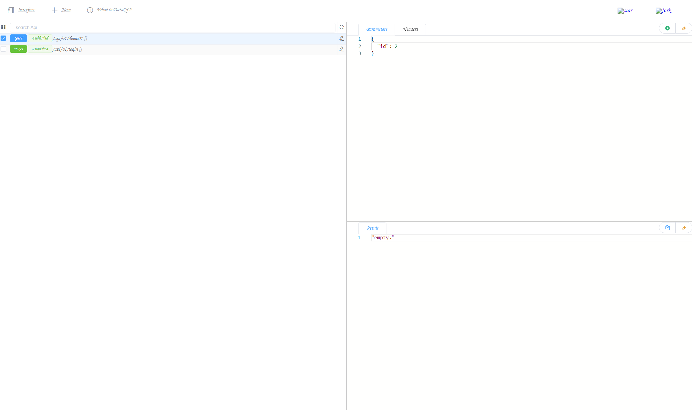

## 前言

由于之前在网上找到很多资料基本上都一样的教程，
这个作为一个新型东西，更新换代比较快，
而这些教程很多在现阶段已经不可用了，
所以在结合自己查阅的大量资料和一点自己的知识做了一个demo。

## 介绍

这是官网 ：https://www.hasor.net/doc/

## 使用

1. 加入依赖

```XML

<dependency>
    <groupId>org.springframework.boot</groupId>
    <artifactId>spring-boot-starter-web</artifactId>
</dependency>

<dependency>
<groupId>net.hasor</groupId>
<artifactId>hasor-spring</artifactId>
<version>4.2.5</version>
</dependency>

<dependency>
<groupId>net.hasor</groupId>
<artifactId>hasor-dataway</artifactId>
<version>4.2.5</version>
</dependency>

<dependency>
<groupId>mysql</groupId>
<artifactId>mysql-connector-java</artifactId>
</dependency>

<dependency>
<groupId>com.alibaba</groupId>
<artifactId>druid</artifactId>
<version>1.2.9</version>
</dependency>

<dependency>
<groupId>org.springframework.boot</groupId>
<artifactId>spring-boot-starter-jdbc</artifactId>
</dependency>

<dependency>
<groupId>com.alibaba</groupId>
<artifactId>druid-spring-boot-starter</artifactId>
<version>1.2.9</version>
</dependency>
```

2. 配置环境

```yaml
# 是否启用 Dataway 功能（必选：默认false）
HASOR_DATAQL_DATAWAY: true

# 是否开启 Dataway 后台管理界面（必选：默认false）
HASOR_DATAQL_DATAWAY_ADMIN: true

# dataway  API工作路径（可选，默认：/api/）
HASOR_DATAQL_DATAWAY_API_URL: /api/

# dataway-ui 的工作路径（可选，默认：/interface-ui/）
HASOR_DATAQL_DATAWAY_UI_URL: /interface-ui/

# SQL执行器方言设置（可选，建议设置）
HASOR_DATAQL_FX_PAGE_DIALECT: mysql

spring:
#  数据库配置
  datasource:
    type: com.alibaba.druid.pool.DruidDataSource
    driver-class-name: com.mysql.jdbc.Driver
    url: jdbc:mysql://127.0.0.1:3306/demo_dataway
    username: root
    password: root
    druid:
      initial-size: 3
      min-idle: 3
      max-active: 10
      max-wait: 60
      # 设置用户名和密码
      stat-view-servlet:
        login-username: admin
        login-password: admin
      filter:
        stat:
          log-slow-sql: true
          slow-sql-millis: 1
  # springboot 2.6 发布了一个重要的更新，是将处理映射匹配的默认策略由AntPathMatcher改为PathPatternParser，
  # 这个改动，影响了许多使用自定义Filter的项目，同样影响了dataway。
  mvc:
    pathmatch:
      matching-strategy: ant_path_matcher

# 解决中文乱码
server:
  servlet:
    encoding:
      charset: UTF-8
      force: true
      enabled: true

```
3. 创建数据库  
   demo_dataway.sql
4. 运行项目  
   在浏览器中输入 : http://localhost:8080/interface-ui/
   输入用户名和密码




